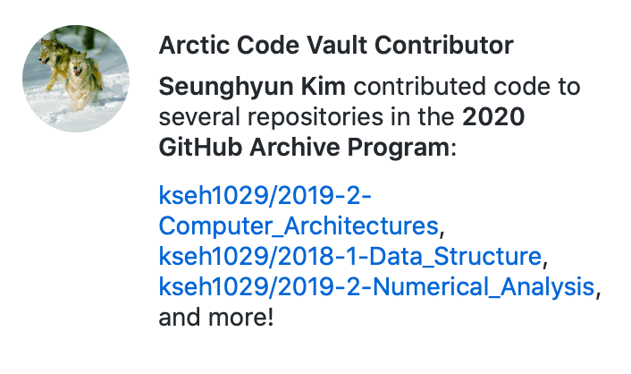

# 2020년 SW중심대학 전자공학부 연계전공(IT융합)

### 요약문 및 형태별 추가정보 기재는 양식에 따라 `summary.md` 에 추가하였다.

### [summary.md 로 바로 이동하려면 이곳을 클릭하면 된다.](summary.md)

## github 자료 위치 설명

특정 Repository 를 만들고 경북대학교의 SW부전공 자료만을 정리한게 아니라, 평소 기록할 자료가 있으면 github Main 에 업로드 하였으므로 본

github 전체에 자료가 업로드 되어있다.

즉 https://github.com/kseh1029 에서 모든 내용을 확인할 수 있다.

학교와 관련된 자료는 년도-학기-교과목 명으로 정리 <예) 2020-1-Automatic_Control_System> 하였다.

그 외에 자료는 대표적인 주제와 내용에 으로 정리하였다 <예) Arduino-Dust_Checker>

또한 해당 Markdown 에서 과목명을 클릭하면 바로 Repository 로 이동하도록 하이퍼링크가 되어있다.

## Github Arctic Code Vault Contributor 선정

Github 에 따르면 핵전쟁 등 지구적 재난으로 인한 기술 손실을 대비하여 나의 Github 에 있는 Open Source 코드를 세계기록 보관소 (Arctic World Archive) 에 저장하는 2020 Github Archive Program 에 저장하였다고 한다. 이로 인해 이 기록들은 1000년간 보관이 되며, 이를 계기로 조금 더 Quality 가 좋은 자료를 올려야 할 책임감을 느끼게 되었다.

